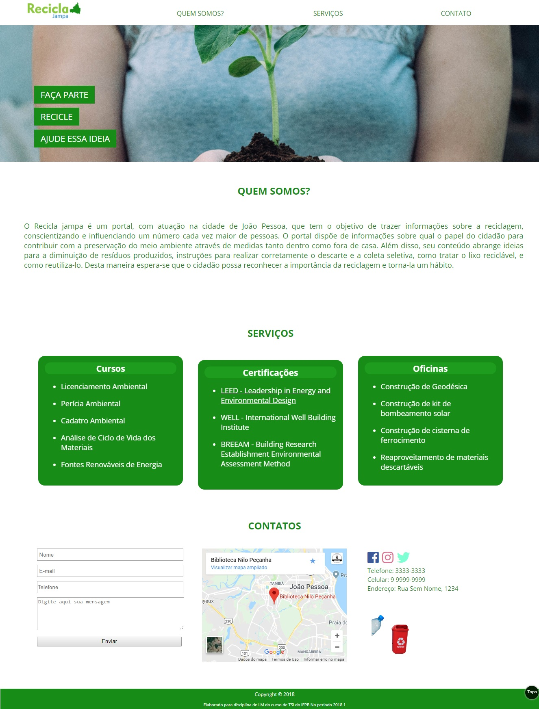

# NOME-DO-PROJETO
RECICLA JAMPA
## Descrição
O Recicla jampa é um portal, com atuação na cidade de João Pessoa, que tem o objetivo de trazer informações sobre a reciclagem, conscientizando e influenciando um número cada vez maior de pessoas. O portal dispõe de informações sobre qual o papel do cidadão para contribuir com a preservação do meio ambiente através de medidas tanto dentro como fora de casa. Além disso, seu conteúdo abrange ideias para a diminuição de resíduos produzidos, instruções para realizar corretamente o descarte e a coleta seletiva, como tratar o lixo reciclável, e como reutiliza-lo. Desta maneira espera-se que o cidadão possa reconhecer a importância da reciclagem e torna-la um hábito.
## Inspiração
http://www.maujor.com/tutorial/propriedades-css-para-estilizacao-de-fontes.php#header

## Protótipos

